# DFD2GUI

DFD2GUI adalah aplikasi web yang bertujuan memudahkan *user*(*developer*) dalam membangun antarmuka berdasarkan DFD(*Data Flow Diagram*) yang dibuat sebelumnya oleh *user*. *User* dapat melakukan itu dengan meng-*upload file* metadata DFD dari *software* SAP PowerDesigner versi 16. Pada fitur yang akan dibuat ke depan, aplikasi *web* ini akan dapat memberi user pilihan *template* antarmuka seperti tampilan *login*, *register*, *table*, *form*, dan lain-lain. Setelah itu, *user* juga dapat memberi informasi tambahan terkait data apa saja yang terlibat dari suatu proses yang ada di metadata DFD.

# Installation Guide

## Getting Started

Berikut adalah intruksi yang perlu dilakukan agar dapat berjalan di komputer anda untuk keperluan pengembangan, *testing*, *deployment*, serta apa saja yang perlu di-*install*.

### Prerequisites

Berikut adalah *Tools*, *Library*, dan *framework* yang digunakan di projek ini.

```
Flask

Flask-WTF

Flask-SQLAlchemy

Flask-Bcrypt

Flask-Login
```
Untuk menginstall *library* Flask dan dependensinya, jalankan kode di bawah ini. Pastikan komputer anda terhubung dengan internet.
```
$ pip install -r requirements.txt
```

### Installing

Berikut adalah tahapan untuk dapat menggunakan projek ini.

Pindahkan lokasi direktori anda ke projek ini.

```
$ cd DFD2GUI
```
#### Inisiasi Database
Sebelum dapat menjalankan projek ini di komputer anda, inisiasi database dengan menyalin kode di bawah ini.
```
$ python
```
setelah masuk ke Python IDLE, salin dan jalankan kode dibawah ini secara berurutan.
```
from DFD2GUI import db

db.create_all()
```
Setelah itu, anda dapat keluar dari IDLE dan dapat menjalankan projek ini di komputer anda
#### Menjalankan Server
Untuk menjalankan projek ini di *server* lokal anda. Salin kode di bawah ini ke *terminal* anda.
```
$ python run.py
```

Setelah itu, akan muncul balasan seperti di bawah ini di *terminal* anda.

```
 * Serving Flask app "DFD2GUI" (lazy loading)
 * Environment: production
   WARNING: This is a development server. Do not use it in a production deployment.
   Use a production WSGI server instead.
 * Debug mode: on
 * Restarting with stat
 * Debugger is active!
 * Debugger PIN: 256-720-034
 * Running on http://127.0.0.1:5000/ (Press CTRL+C to quit)
```
Lalu, salin alamat IP yang ada di atas ke *internet browser* anda.

# User Guide
1. Login
   
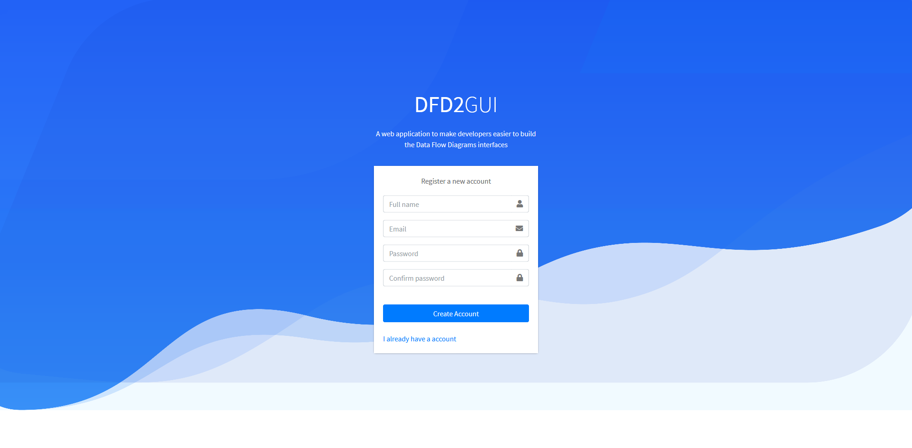
<hr>
2. Register

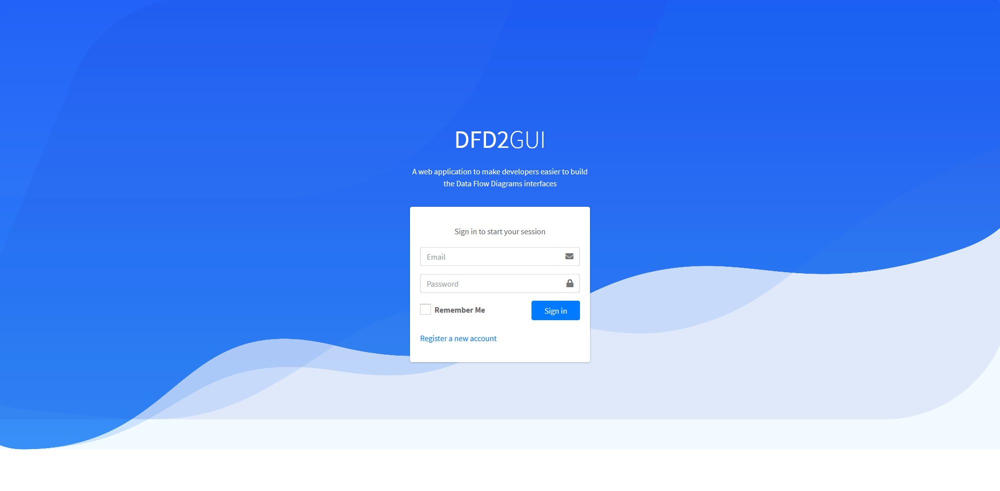
<hr>
3. Dashboard

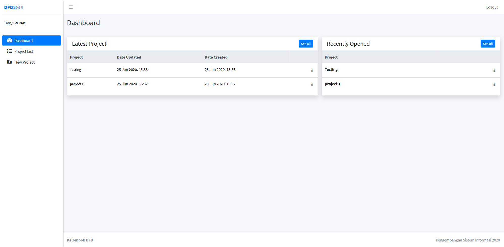
<hr>
4. New Project

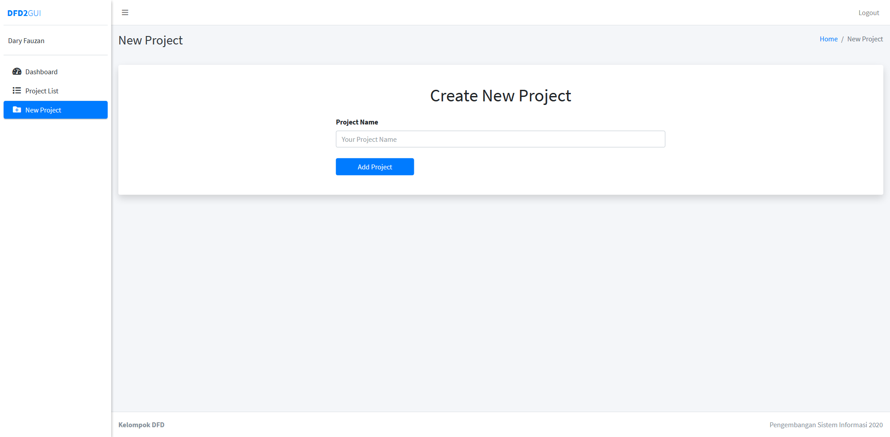
<hr>
5. Add Entity


<hr>
6. Add Datastore

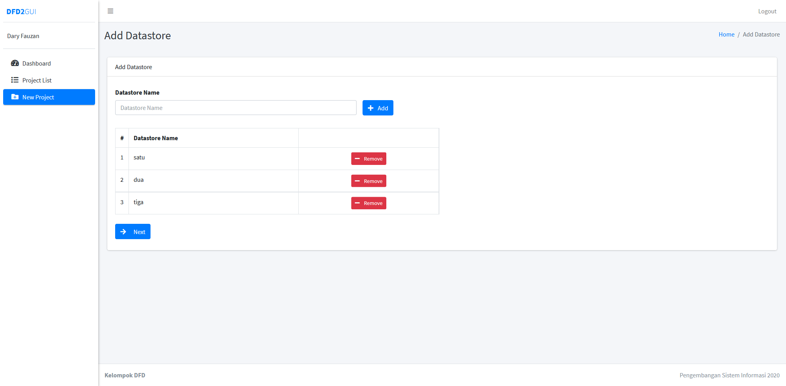
<hr>
7. Add Process

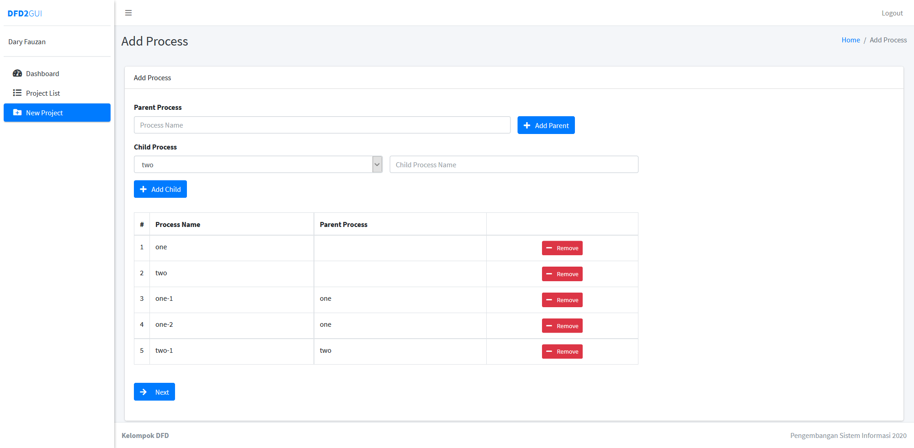
<hr>
8. Add Process Detail

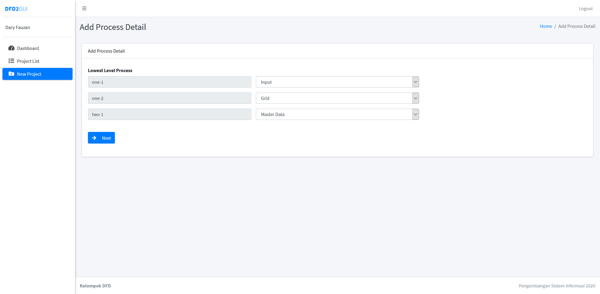
<hr>
9. Add Relation(Data flow)

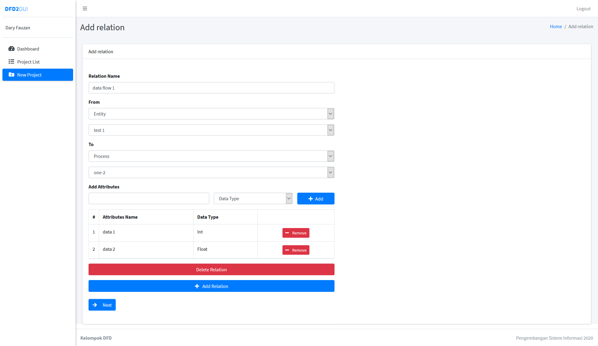
<hr>
10. Add GUI attributes

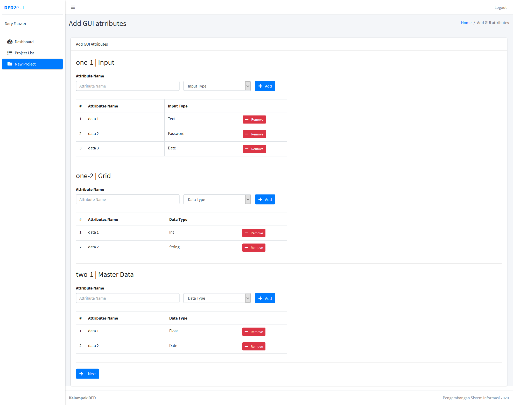
<hr>
11. Project List

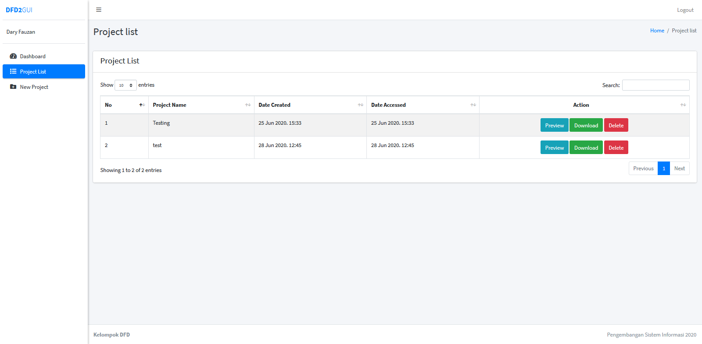
<hr>
12. View Project

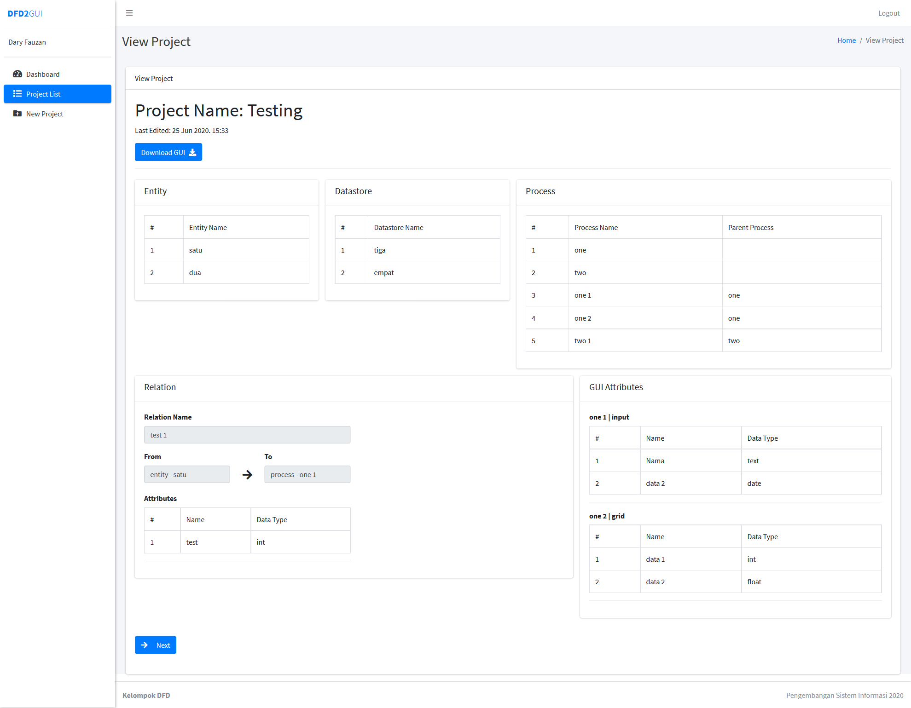
<hr>

## Authors

* 081711633005 - **Christiana natalia Corputty**
* 081711633009 - **Firda Atsalis Maulidya Hasanah**
* 081711633011 - **Alam Al Mabruk**
* 081711633014 - **Fadhil Yusni Ramadhan**
* 081711633018 - **Ersalina Trisnawati**
* 081711633020 - **Muhammad Dary Fauzan**
* 081711633022 - **Mardianta Putra Anggara**
* 081711633030 - **Sinta Sintya**
* 081711633039 - **I Ketut Gerry Putra Hartawan**
* 081711633044 - **Yossy Adirta Soerya Legowo**
* 081711633045 - **Adenegara Rizky Gusty P**
* 081711633051 - **Sherina Avianita**
* 081711633055 - **Salsyabila Putri Pratama**
